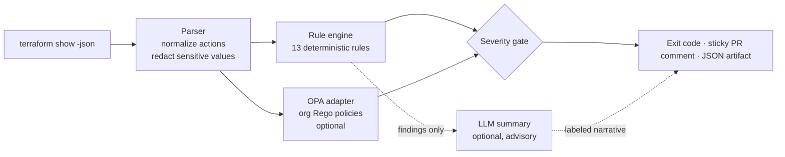

# tf-sentry

Risk review for `terraform plan` in CI: deterministic policy checks that can
fail the build, plus an optional AI blast-radius summary that never can.

[](https://github.com/balvanthreddy/tf-sentry/actions/workflows/ci.yml)
[](LICENSE)
[](pyproject.toml)

## The problem

Infrastructure PRs get approved by humans skimming 3,000-line plan output.
The change that matters — a stateful database quietly scheduled for
replacement, an IAM policy widening to `*`, a security group opening SSH to
the internet — renders as one line among thousands. Reviewers miss it; the
incident happens at apply time, or worse, three weeks later.

`tf-sentry` reads the machine-readable plan (`terraform show -json`) and
reviews it the way a paranoid senior engineer would — deterministically,
with evidence, on every PR.

```
$ tf-sentry review plan.json

[CRITICAL] DEL001 aws_db_instance.orders
  Stateful resource destroyed: aws_db_instance
  This delete destroys data or irrecoverable state, not just infrastructure. ...
  evidence: plan action: delete on aws_db_instance.orders
  fix: If this is a rename/move, use a `moved` block or `terraform state mv` ...

[CRITICAL] IAM002 aws_iam_role.external_integration
  Role assumable by any principal
  Principal '*' without a Condition means any AWS account can assume this role ...

Findings: CRITICAL: 4, HIGH: 6, MEDIUM: 2
Gate: fail on HIGH+ -> FAIL
```

## The design thesis

> **Everything enforceable is deterministic; the LLM only narrates.**

- **Rules** (Python) and **policies** (optional Rego/OPA) parse the plan and
  fail the build. Same input, same verdict, every time. Auditable, testable,
  no API keys required.
- The **AI summary** is optional, clearly labeled, and *structurally*
  advisory: it cannot change the exit code, suppress a finding, or approve
  anything. If the LLM is down, the review still runs. If a malicious
  resource name tries prompt injection, the worst case is a weird paragraph
  — never a green check.

This is the division of labor AI-assisted CI should have, and `tf-sentry`
is useful with zero AI configured.

## Quickstart

### GitHub Action (recommended)

```yaml
name: terraform-plan
on: pull_request

permissions:
  contents: read
  pull-requests: write   # for the sticky review comment

jobs:
  plan-review:
    runs-on: ubuntu-latest
    steps:
      - uses: actions/checkout@v4
      - uses: hashicorp/setup-terraform@v3

      - run: terraform init -input=false
      - run: terraform plan -input=false -out=plan.out
      - run: terraform show -json plan.out > plan.json

      - uses: balvanthreddy/tf-sentry@v1
        with:
          plan-json: plan.json
          fail-on: high          # critical | high | medium | low | never
```

The action posts one **sticky PR comment** (updated in place on every push,
not a trail of stale bot comments), uploads a JSON report, and fails the job
when findings reach the threshold.

### CLI

```bash
pip install git+https://github.com/balvanthreddy/tf-sentry

terraform plan -out=plan.out
terraform show -json plan.out > plan.json
tf-sentry review plan.json                          # human-readable + exit code
tf-sentry review plan.json --format json            # machine-readable
tf-sentry review plan.json --fail-on never          # report-only mode
```

Exit codes: `0` pass · `1` gate failure · `2` execution error.

### Try it right now (no cloud account needed)

```bash
git clone https://github.com/balvanthreddy/tf-sentry && cd tf-sentry
pip install -e .
tf-sentry review examples/plans/risky-change.json           # 11 findings, gate fails
tf-sentry review examples/plans/safe-change.json            # clean pass
```

## What it catches

| Family | Rules | Examples |
|---|---|---|
| Destructive changes | `DEL001–DEL004`, `DEL900` | stateful resource deleted or replaced (with the *forcing attribute* as evidence), `force_destroy` enabled, deletion protection removed, plan-wide blast radius |
| IAM privilege widening | `IAM001–IAM004` | `Action:*`/`Resource:*` (parsed out of policy JSON strings where text review can't see them), `NotAction` allow-lists, roles assumable by `Principal:*`, AdministratorAccess attachments, static access keys |
| Network exposure | `NET001–NET002` | ingress from `0.0.0.0/0` — CRITICAL on SSH/RDP/database ports, HIGH otherwise; databases flagged `publicly_accessible` |
| Storage risk | `STO001–STO003` | S3 public-access-block weakened, public ACLs, at-rest encryption disabled, backup retention/versioning reduced |

Design details that keep the signal clean:

- **Changed-only detection**: update actions fire only when the risky
  attribute actually changed — pre-existing conditions don't spam every PR.
- **Secrets never leak**: attributes Terraform marks sensitive are redacted
  at the parse boundary, before any rule, report, or prompt sees them.
- **Deterministic reports**: findings sort stably, so report diffs are
  meaningful.

## Configuration

Optional `.tf-sentry.yaml` at the repo root:

```yaml
fail_on: high                # critical | high | medium | low | never
ignore:
  - module.sandbox.*         # fnmatch globs on resource addresses
rules:
  NET001:
    severity: critical       # escalate for your environment
  IAM004:
    enabled: false           # accepted risk, documented here in review
blast_radius:
  max_deletes: 10
```

## Organization policies (OPA/Rego)

Built-in rules cover universal risks. Org-specific policy ("every resource
tagged", "only approved providers") belongs to your policy team in Rego:

```bash
tf-sentry review plan.json --rego-dir policies/
```

Policies live in package `tfsentry` and emit `deny`/`warn` entries — see
[policies/](policies/) for working examples and [docs/rego.md](docs/rego.md)
for the contract. A configured-but-missing `opa` binary is a **hard error**:
a security gate that silently skips configured policy is lying about
coverage.

## AI summary (optional)

```yaml
      - uses: balvanthreddy/tf-sentry@v1
        with:
          plan-json: plan.json
          summarize: "true"
        env:
          TF_SENTRY_LLM_PROVIDER: openai_compatible   # or bedrock | fake
          TF_SENTRY_LLM_MODEL: gpt-4o-mini
          TF_SENTRY_LLM_API_KEY: ${{ secrets.LLM_API_KEY }}
```

The model receives the structured findings (already redacted) — never raw
plan JSON — and writes a short narrative connecting them ("the deleted
security group is referenced by the replaced instance"). It is labeled
AI-generated in the comment and has no vote on pass/fail. Full threat
notes in [SECURITY.md](SECURITY.md).

## Architecture



Decision records live in [docs/adr/](docs/adr/): why deterministic rules
gate and AI doesn't (ADR-0001), why redaction happens at the parse boundary
(ADR-0002), and why OPA is an external adapter rather than embedded
(ADR-0003).

## Development

```bash
make install      # editable install + dev deps
make test         # 100+ tests; OPA tests skip without the opa binary
make lint typecheck
make demo         # review the risky example plan
```

The **detection corpus** ([tests/corpus](tests/corpus)) pins realistic plan
fixtures to exact expected findings in both directions — a rule that stops
firing *or* starts over-firing fails CI. Contributions of new rules must
extend the corpus; see [CONTRIBUTING.md](CONTRIBUTING.md).

## Roadmap

- Cost-delta hints (Infracost integration) alongside risk findings
- GitLab CI and Bitbucket renderers
- Azure/GCP rule parity with the AWS set (types are already in DEL001)
- SARIF output for GitHub code scanning
- Terraform Cloud run-task integration

## License

Apache 2.0 — see [LICENSE](LICENSE).
